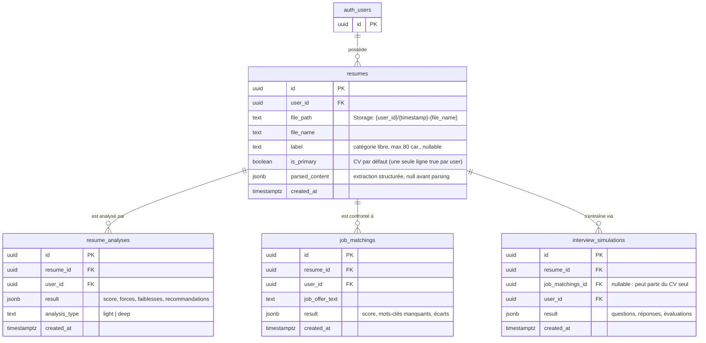

# ForPro AI — Spécifications Produit (MVP)

> **Source de vérité produit.** Ce document fait foi pour le périmètre fonctionnel.
> Toute évolution de périmètre doit être reflétée ici avant implémentation.

| Champ | Valeur |
|---|---|
| Version du document | 2.0 |
| Sprint | 2 |
| Statut | Validé pour développement |
| Dernière mise à jour | 2026-08-29 |
| Stack | Next.js (App Router), TypeScript (Strict), Tailwind CSS, Supabase (SSR, free tier), Vitest, Playwright |

---

## 1. Contexte & Vision

ForPro AI est un MVP à vocation académique/portfolio. La proposition de valeur :
**analyser un CV, le confronter à une offre d'emploi, et s'entraîner à l'entretien** —
le tout assisté par IA.

Le constat produit du Sprint 1 est classique : un produit exigeant une inscription
**avant** de démontrer sa valeur crée un funnel trop coûteux pour le visiteur. Le Sprint 2
introduit donc un **funnel d'accès immédiat** (Quick Test sans compte) couplé à une
expérience enrichie pour les utilisateurs authentifiés (Catalogue de CVs).

### 1.1 Objectifs Sprint 2

1. **Percevoir la valeur en < 2 minutes** sans créer de compte.
2. **Convertir** le visiteur en utilisateur inscrit au moment où la valeur est perçue.
3. **Structurer les données** : un CV est un *actif durable* ; les analyses, matchings
   et simulations d'entretien sont des *journaux d'événements* rattachés à ce CV.
4. Poser les fondations du freemium (limites claires, mesurables, évolutives).

### 1.2 Dual-Mode UX — Vue d'ensemble

| | Mode Visiteur (Quick Test) | Mode Catalogue (Inscrit) |
|---|---|---|
| Authentification | Aucune | Requise (Supabase Auth) |
| Objectif UX | Valeur immédiate → conversion | Gestion & progression dans le temps |
| CV | 1 CV à la fois, éphémère | Bibliothèque de plusieurs CVs (⭐ par défaut) |
| Analyse | Check léger, résultat tronqué | Analyse approfondie + historique complet |
| Matching offre | Non | Oui |
| Historique | Non | Oui (analyses, matchings, entretiens) |
| Persistance | Aucune (éphémère) | Complète (Postgres + Storage) |

---

## 2. Mode Visiteur — Quick Test (Funnel d'acquisition)

### 2.1 Parcours utilisateur

```
[ Landing / CTA "Testez votre CV gratuitement" ]
        │
        ▼
[ Upload PDF/DOCX (drag & drop ou sélection) ]
        │  validation client + serveur : PDF & DOCX, ≤ 5 Mo
        ▼
[ Écran de traitement ]  ── pipeline léger : extraction texte + check automatisé
        │
        ▼
[ Résultat gratuit (v2) ]
   • Rapport complet : score global + par dimension
   • Points forts / points faibles / recommandations
   • Conseils d'expert ciblés
        │
        ▼
[ CTA de conversion ]
   "Créez un compte pour débloquer l'analyse complète,
    le matching offre et votre historique."
```

### 2.2 Règles fonctionnelles

- **Un seul CV à la fois.** Relancer le test remplace le CV précédent ; rien n'est conservé.
- **Formats acceptés :** PDF et Word (.docx) en mode visiteur (limite 5 Mo).
- **Aucune persistance :** le fichier et le résultat ne sont ni stockés en base,
  ni dans Storage. Le traitement est éphémère (durée de vie = la session de requête).
- **Rate limiting :** plafond d'analyses par IP / 24 h, configurable via
  `QUICK_TEST_RATE_LIMIT` — cible production : 1 / IP / 24 h ; défaut MVP : 30
  (démo). Seuls les événements d'analyse consomment le quota.
- **Le rapport complet est la vitrine (v2).** Le visiteur reçoit la même
  profondeur d'analyse qu'un compte (score global + par dimension, forces /
  faiblesses, recommandations, conseils d'expert) ; les fonctions au-delà
  (matching offre, bibliothèque, historique) restent des CTA de conversion.

### 2.3 Points de conversion

| Déclencheur | Message | Destination |
|---|---|---|
| Résultat affiché | "Débloquez l'analyse complète" | `/signup` (contexte : analyse en attente) |
| Fin de lecture du score | "Comparez votre CV à une offre" | `/signup` |
| Tentative d'accès à une section verrouillée | Overlay conversion | `/signup` |

> **Note d'implémentation (future)** : lors de l'inscription déclenchée depuis un
> Quick Test, l'expérience idéale permettrait de "reprendre" le CV du visiteur.
> Ceci est **hors périmètre Sprint 2** (voir §7) mais influence le design de l'API.

---

## 3. Mode Catalogue — Utilisateurs authentifiés

### 3.1 Bibliothèque de CVs

- L'utilisateur gère **plusieurs CVs** dans une bibliothèque personnelle
  (variantes par cible : "CV Dev", "CV Data", versions FR/EN…).
- Chaque CV = un fichier (PDF/TXT, ≤ 5 Mo, bucket privé `resumes`) + métadonnées
  en base (table `resumes`, voir §5).
- Un CV peut être désigné **CV par défaut (⭐)** — *un seul à la fois par utilisateur*.
  Le CV par défaut est présélectionné dans toute nouvelle analyse, matching ou
  simulation d'entretien.
- Actions : lister, uploader, renommer, définir par défaut, supprimer
  (cascade Storage + base, soft-delete envisagé mais hors Sprint 2).

### 3.2 Analyse approfondie

- Analyse complète d'un CV choisi dans la bibliothèque (score détaillé par section,
  recommandations illimitées, comparaison à des bonnes pratiques du marché).
- Chaque analyse est **journalisée** et rattachée au CV analysé
  (table `resume_analyses`, voir §5.2) — l'historique est consultable.

### 3.3 Matching avec une offre d'emploi

- L'utilisateur colle (ou saisit) le texte d'une offre d'emploi.
- Le système produit : score de correspondance global, mots-clés manquants,
  écarts par exigence, suggestions de reformulation du CV.
- Journalisé dans `job_matchings`, rattaché au CV utilisé.

### 3.4 Historique & simulations d'entretien

- Vue chronologique regroupant : analyses, matchings, simulations d'entretien,
  filtrable par CV.
- Les simulations d'entretien (Q/R générées à partir d'un CV + offre) sont
  journalisées dans `interview_simulations`.

---

## 4. Tiers & Limites (Freemium)

### 4.1 Visiteur (non authentifié)

| Ressource | Limite |
|---|---|
| Tests de CV (Quick Test) | Configurable `QUICK_TEST_RATE_LIMIT` — cible prod : 1 / IP / 24 h (défaut MVP : 30) |
| Formats | PDF + Word (.docx) |
| Taille fichier | 5 Mo max |
| Profondeur d'analyse | Rapport complet, identique au tier gratuit (v2) |
| Persistance / historique | Aucun |
| Matching offre | Non disponible |
| Simulations d'entretien | Non disponibles |

### 4.2 Utilisateur inscrit (tier gratuit)

| Ressource | Limite Sprint 2 |
|---|---|
| CVs en bibliothèque | 5 actifs max |
| Analyses approfondies | 10 / mois |
| Matchings d'offre | 5 / mois |
| Simulations d'entretien | 3 / mois |

> ⚠️ Les quotas du tier inscrit sont des **placeholders produit** à calibrer avec
> les métriques réelles de coût API (§6). Ils doivent être centralisés dans une
> constante unique côté code (jamais dupliqués) pour être ajustables sans refactor.

---

## 5. Modèle de données — Assets vs Journaux

### 5.1 Principe structurant

> **Un CV (`resume`) est un actif durable appartenant à l'utilisateur.
> Une analyse, un matching ou un entretien est un événement horodaté,
> enfant d'un CV, immuable une fois produit.**

Conséquences :

- Supprimer une analyse ne supprime jamais le CV ; supprimer un CV **cascade**
  sur tous ses journaux enfants.
- Les journaux sont append-only : pas d'UPDATE du contenu du résultat, seulement
  des métadonnées (ex. statut du job).
- Le fichier du CV vit dans Storage (bucket privé `resumes`) ; la base ne stocke
  que métadonnées + contenu extrait (`parsed_content jsonb`).

### 5.2 Schéma cible (Sprint 2)



### 5.3 État existant & migrations à venir

| Migration | Contenu | Statut |
|---|---|---|
| `001_resumes_and_storage.sql` | Table `resumes` + bucket privé `resumes` (PDF/TXT, 5 Mo) + RLS (`auth.uid() = user_id`, dossier par user) | ✅ Appliquée |
| `002_add_primary_resume.sql` | Colonne `resumes.is_primary` + index unique partiel (`resumes_one_primary_per_user_idx` sur `(user_id) where is_primary`) + trigger de bascule atomique du ⭐ + policy UPDATE manquante sur `resumes` | ✅ Créée (Sprint 2) |
| `003_resume_analyses.sql` | Tables `resume_analyses` (light/deep, score 0–100, `structured_output` jsonb) et `job_matchings` (`job_title`, `job_description`, `match_score`, `matching_details`) + FK composite `(resume_id, user_id)` anti cross-tenant + cascades + RLS select/insert/delete (append-only, sans UPDATE) + index `(user_id, created_at desc)` et `(resume_id, created_at desc)` | ✅ Créée (Sprint 2) |
| `004_resume_labels.sql` | Colonne `resumes.label` (catégorie/description libre, max 80 caractères, NULL par défaut) + CHECK `resumes_label_length_check` | ✅ Créée (Sprint 2) |
| `004_interview_simulations.sql` | Table `interview_simulations` (enfant de `resumes`, FK nullable vers `job_matchings`) + RLS | 📋 À faire |

Règles RLS à reproduire sur toutes les tables enfants : **select/insert limités à
`auth.uid() = user_id`** ; pas de delete direct attendu (cascade depuis `resumes`).

### 5.4 Cas du visiteur (Quick Test)

- **Aucune ligne en base.** L'analyse visiteur est éphémère (réponse de requête,
  éventuellement session chiffrée côté client).
- Le champ `analysis_type = 'light'` est prévu dans `resume_analyses` pour que,
  à terme, une analyse visiteur "reprise" après inscription puisse être historisée
  avec la même entité que les analyses profondes.
- Le rate-limiting visiteur est un mécanisme applicatif adossé à la table
  `quick_test_events` (comptage par `ip_hash` sur 24 h, événements d'analyse
  uniquement — voir `RATE_LIMITED_EVENT_TYPES`).

---

## 6. Métriques de succès (Sprint 2)

| Métrique | Cible MVP |
|---|---|
| Taux de complétion du Quick Test (upload → résultat) | ≥ 70 % |
| Conversion visiteur → inscrit post-analyse | ≥ 8 % |
| Utilisateurs avec ≥ 2 CVs en bibliothèque | ≥ 25 % |
| Utilisateurs utilisant le matching ≥ 1 fois | ≥ 40 % |
| Coût API moyen / Quick Test | À mesurer (calibrage quotas §4.2) |

---

## 7. Hors périmètre (Non-Goals Sprint 2)

- Récupération automatique du CV visiteur lors de l'inscription (reprise de session).
- OCR / CVs scannés (images) — PDF texte et TXT uniquement.
- Paiement / tier payant (les quotas §4.2 préparent le terrain, sans billing).
- Partage public de CVs ou de résultats d'analyse.
- Édition en ligne du CV (l'actif reste le fichier uploadé).
- Parsing côté visiteur avec persistance différée.

---

## 8. Journal des changements du document

| Version | Date | Changement |
|---|---|---|
| 2.0 | 2026-08-29 | Sprint 2 : funnel visiteur (Quick Test), tier gratuit, mode Catalogue (bibliothèque + CV ⭐), séparation data model asset vs journaux d'analyse. |

